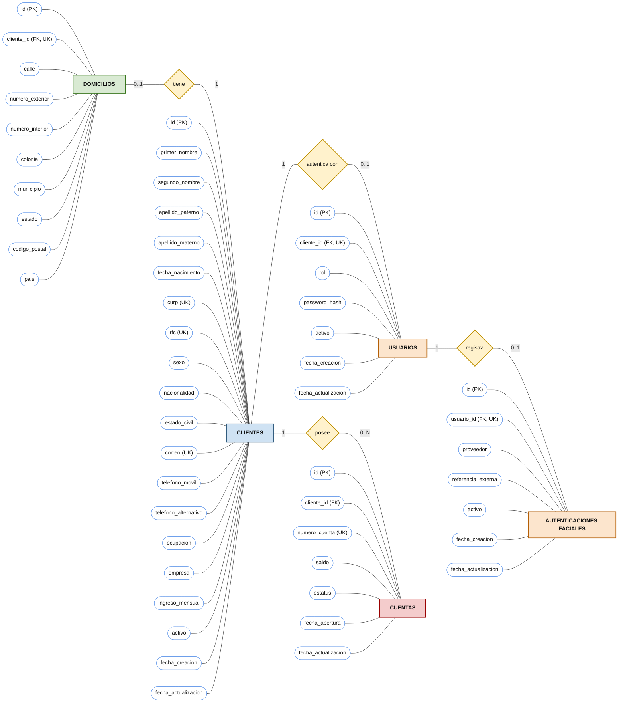

# Diagrama entidad-relación (notación Chen)

Este diagrama utiliza el estilo de la referencia: rectángulos para entidades, rombos para relaciones y óvalos para atributos. Los atributos marcados como `(PK)` son claves primarias; `(UK)` indica una restricción de unicidad.

## Notas del modelo

- El correo se almacena una sola vez en `clientes.correo`; el login lo obtiene a través de la relación entre usuario y cliente.
- `usuarios.rol` admite `CLIENTE` y `EJECUTIVO`. El registro público crea usuarios `CLIENTE`.
- `cliente_id` es único en `domicilios` y `usuarios`, por lo que cada cliente puede tener como máximo un domicilio y un usuario. El flujo de registro crea ambos.
- Una cuenta pertenece a un cliente; un cliente puede tener cero o más cuentas.
- La autenticación facial todavía no está integrada. La tabla solo representa la referencia que se asociaría con un proveedor externo; no almacena imágenes ni plantillas biométricas.
- En `autenticaciones_faciales`, la unicidad se aplica a la combinación `(proveedor, referencia_externa)`, no a cada campo por separado.
- La baja es lógica. Las claves foráneas restringen el borrado físico de registros relacionados.
